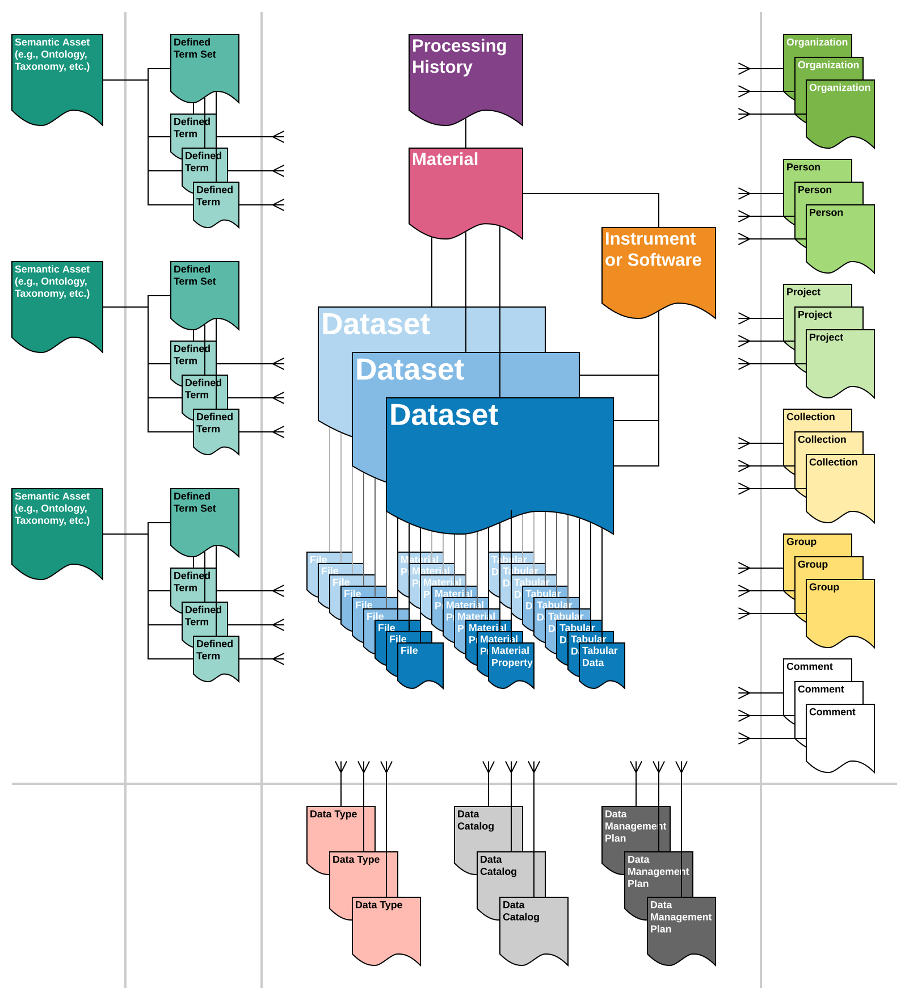

# Preface

The summary below has been created for the specific purpose requesting feedback. Please provide feedback via GitHub issue or by contacting [zachary.trautt@nist.gov](mailto:zachary.trautt@nist.gov?subject=mgi-json-schema).

# Background

The [Materials Genome Initiative](https://mgi.gov/) (MGI) is a multi-agency initiative designed to create a new era of policy, resources, and infrastructure that support U.S. institutions in the effort to discover, manufacture, and deploy advanced materials twice as fast, at a fraction of the cost. The missions of the MGI and National Institute of Standards and Technology (NIST) are tightly aligned. NIST has assumed a leadership role within the MGI, where one focus is the establishment of essential materials data and model exchange protocols. Read more about the [MGI at NIST](https://www.nist.gov/mgi).

Initial efforts around materials data exchange protocols resulted in coupled concerns, specifically:

- Coupling of syntactic interoperability and semantic interoperability (as defined in [doi: 10.1177/875647930600300104](https://doi.org/10.1177/875647930600300104))
- Coupling of human presentation/interaction layer to the data management and access layer within prototype web applications.

We have observed that these couplings have limited the pace and comprehensiveness of development of materials data infrastructure.

## Separation of Concerns

### Comparison of Coupled and Decoupled Syntactic and Semantic Representations

A simple example of **coupled** syntactic and semantic representation is shown below:
```
{
    "youngsModulus": {
        "value": 179,
        "unit": "GPa"
    },
    "ultimateTensileStrength": {
        "value": 855,
        "unit": "MPa"
    },
    "yieldStrength": {
        "value": 494,
        "unit": "MPa"
    }
}
```
In this example, a semantic concept is explicitly invoked in the underlying data model where `"youngsModulus"` is an expected key name. This tactic, while valid, results in client applications that must have domain-specific understanding of the underlying data model, which drastically increases the overall development burden.

A simple example of **decoupled** syntactic and semantic representation is shown below:

```
{
    "quantity": [
        {
            "name": "Young's Modulus",
            "identifier": "doi:abc/123",
            "value": 179,
            "unit": "GPa"
        },
        {
            "name": "Ultimate Tensile Strength",
            "identifier": "doi:abc/234",
            "value": 855,
            "unit": "MPa"
        },
        {
            "name": "Yield Strength",
            "identifier": "doi:abc/345",
            "value": 494,
            "unit": "MPa"
        }
    ]
}
```

In this example, the underlying data model is completely agnostic to the existence of the domain-specific concept of `"Young's Modulus"`. The underlying data model would specify a syntactic representation for the domain agnostic concept of a `"quantity"`. This tactic allows for the development of domain agnostic client applications and reduces the overall development burden. The named concept of `"Young's Modulus"` can also have an associated persistent identifier, which could enable direct linkage to semantic assets such as ontologies, taxonomies, etc. Such concepts can be defined using technologies such as [https://www.w3.org/OWL/](https://www.w3.org/OWL/).

### Comparison of Coupled and Decoupled Model Web Applications

In Figure 1, we show: (a) a model web application architecture where the human interface layer is coupled to the model (i.e., logic) layer and the data access layer, and (b) a model web application architecture where the human interface layer is decoupled from the service layer. In the decoupled case, the human interface layer accesses the service layer via an application programming interface (API). While decoupled web application architecture introduces new constraints, it also provides many benefits. These benefits are well-described in online resources (including but limited to):

- [Oracle: Learn About the Microservices Architecture](https://docs.oracle.com/en/solutions/learn-architect-microservice/index.html)
- [Martin Fowler: Microservices](https://martinfowler.com/articles/microservices.html)
- [Red Hat: What are microservices?](https://www.redhat.com/en/topics/microservices/what-are-microservices)

The use of decoupled web application architectures has experienced growing adoption within the private sector and has resulted in the widespread development of "headless" content management systems (including but limited to):
- [Contentful](https://www.contentful.com/)
- [Contentstack](https://www.contentstack.com/)
- [Cloud CMS](https://www.cloudcms.com/)

Within materials science and engineering, a common way to divide the problem space is data producers vs. data consumers. When applied to web applications, data producers and data consumers have different requirements. We have observed that these differences are the largest at the human interface layer and smaller at the other layers. For this use case, in the coupled paradigm (Figure 1.a), a data producer would be required to replicate their data in the system designed for data consumers. This places undue burden on the data producer as they are now required to maintain multiple copies of the data on multiple systems. For this use case in the decoupled paradigm (Figure 1.b), views optimized for different classes of data producers and data consumers can be rapidly developed. For example, a data producer may want to leverage a resource registered in a resource registry, thus a data producer may benefit from a view of resource registry records that is integrated with the data management interface. Likewise, a data producer would benefit from an integrated view of published and unpublished data and would further benefit from a programmatic ability to publish data.


**Figure 1:** A simplified comparison of (a) coupled and (b) decoupled web application architectures.

Two documents, which were published about a decade apart, have made similar statements regarding the state of interoperability in materials science and engineering:

**[2008] Integrated Computational Materials Engineering - A Transformational Discipline for Improved Competitiveness and National Security**
[https://nap.edu/12199](https://nap.edu/12199)
> *Currently the schemas for describing the breadth of database types are at varying degrees of maturity.*

**[2018] Vision 2040: A Roadmap for Integrated, Multiscale Modeling and Simulation of Materials and Systems**
[https://ntrs.nasa.gov/search.jsp?R=20180002010](https://ntrs.nasa.gov/search.jsp?R=20180002010)
> *Critical Gap: No widely accepted community standards or schema for
materials information storage and communication methods*

This highlights the need for renewed focus and perhaps a different approach in the development of essential materials data exchange protocols.

# Introduction

The focus of this project is demonstrating maximal usage of existing specifications for syntactic and semantic representation of data and metadata within materials science and engineering. The benefit of maximally leveraging existing specifications is that it enables one to also leverage existing client tools. Within the domain of materials data infrastructure (MDI) and information and communication technologies (ICT) more broadly, there has been numerous efforts and developments. A few that are specifically relevant are:
- Research Data Alliance (RDA) Activities:
  - [RDA/CODATA Materials Data, Infrastructure & Interoperability IG](https://www.rd-alliance.org/groups/rdacodata-materials-data-infrastructure-interoperability-ig.html)
  - [Data Type Registries WG](https://rd-alliance.org/groups/data-type-registries-wg.html)
  - [Persistent Identification of Instruments WG](https://www.rd-alliance.org/groups/persistent-identification-instruments-wg)
  - [Physical Samples and Collections in the Research Data Ecosystem IG](https://rd-alliance.org/groups/physical-samples-and-collections-research-data-ecosystem-ig)
  - [Research Metadata Schemas WG](https://www.rd-alliance.org/groups/research-metadata-schemas-wg)
- Materials-related Ontologies, Taxonomies, etc.:
  - [International Materials Ontology Interest Group](https://emmc.info/matontoint/)
  - [QUDT Ontologies](http://www.qudt.org/)
  - [MaterialWays](http://wiki.knoesis.org/index.php/MaterialWays)
  - [MatVocab](http://wiki.knoesis.org/index.php/MatVocab)
  - [Ontologies for the MatOnto Project](https://github.com/inovexcorp/MatOnto-Ontologies)
  - [Simple Knowledge Organization System (SKOS) version of Materials Data Vocabulary](https://doi.org/10.18434/T4/1435037)
  - [NASA Thesaurus](https://www.sti.nasa.gov/nasa-thesaurus/)
  - [Materials Property Ontology](https://github.com/cpauloh/semmd/tree/master/onto)
  - [Semantic Materials, Manufacturing, and Design](https://github.com/cpauloh/semmd)
  - [Materials Ontology: An Infrastructure for Exchanging Materials Information and Knowledge](https://doi.org/10.2481/dsj.008-041)
  - [PREMΛP: Knowledge Driven Design of Materials and Engineering Process](https://doi.org/10.1007/978-81-322-1050-4_105)
  - [A semantic knowledge management system for laminated composites](https://doi.org/10.1016/j.aei.2013.12.004)
  - [Material Class vocabulary](https://vocabs.ands.org.au/viewById/187)
  - [The Plinius ontology of ceramic materials](https://pdfs.semanticscholar.org/5f28/06ddecc02786a84a051a2ed0e8f8f20af0c6.pdf)
  - [A Design for Additive Manufacturing Ontology](https://doi.org/10.1115/1.4035787)
- Industry-lead development of protocols for machine-actionable representation of data and metadata:
  - [https://schema.org/Dataset](https://schema.org/Dataset)
    - See also: [Schema.org: evolution of structured data on the web](https://doi.org/10.1145/2844544)

# Methods

Our approach aims to address the following goals:

- Embrace persistent identifiers for samples, instruments, and data
- Embrace existing specifications for syntactic representation of data (i.e., existing schemas)
- Embrace existing specifications for semantic meaning of data (i.e., existing ontologies, vocabularies, taxonomies, etc.)
- Embrace web application design principles where the user interface (UI) layer is decoupled from the data management layer, where the UI layer interacts with the REST API of the data management layer.

Due to the growing adoption of Schema.org specifications among private sector ICT stakeholders, we adopt it as the primary mode of syntactic representation, and extend it where necessary for concepts specific to materials science and engineering. We note that Schema.org is used at [https://www.data.gov/](https://www.data.gov/) and is listed as a [resource](https://resources.data.gov/tools/) for those building infrastructure within Federal Agencies. To test the efficacy of this approach in action, we utilize [Cordra](https://www.cordra.org/) as the data management layer and natively store metadata and some data in JSON, which largely conforms to Schema.org specifications. As we are extending Schema.org specifications for use in materials science and engineering, this could serve as a basis for forming Schema.org sub-communities in materials science and engineering. Schema.org sub-communities already exist in:

- [Life science](https://www.w3.org/community/bioschemas/)
- [Medical, healthcare and life-science](https://www.w3.org/community/schemed/)
- [Automotive](https://www.w3.org/community/gao/)
- [Sports](https://www.w3.org/community/sport-schema/)

The core of our approach centers around the use of the [Dataset](https://schema.org/Dataset) specification at [https://schema.org/](https://schema.org/). We note that the [Dataset](https://schema.org/Dataset) has existing vocabulary relevant to materials science and engineering, including:

- [material](https://schema.org/material)
  - This is inherited from CreativeWork. Example: a URL link to the record describing the material. Note, the representation of material is one area which could be extended by the materials community (discussed below).
- [measurementTechnique](https://schema.org/measurementTechnique)
  - Example: Uniaxial tensile test
- [distribution](https://schema.org/distribution)
  - Example: File produced by the instrument
- [variableMeasured](https://schema.org/variableMeasured)
  - Example: A [QuantitativeValue](https://schema.org/QuantitativeValue) representing the derived quantity and units of Young's Modulus.

Therefore, the [Dataset](https://schema.org/Dataset) specification can already represent raw and derived data relevant to materials science and engineering:

```
{
    "@context": "http://schema.org/",
    "@type": "Dataset",
    "name": "Demonstration Dataset",
    "measurementTechnique": "Uniaxial Tensile Test",
    "material": "https://www.nist.gov/example/sample/123.json",
    "distribution": {
        "@type": "DataDownload",
        "url": "https://www.nist.gov/example/data/download/tensile-test-123.csv",
        "encodingFormat": "text/csv"
    },
    "variableMeasured": [
        {
            "@type": "PropertyValue",
            "name": "Young's Modulus",
            "value": {
                "@type": "QuantitativeValue",
                "value": 179,
                "unitText": "GPa"
            }
        },
        {
            "@type": "PropertyValue",
            "name": "Ultimate Tensile Strength",
            "value": {
                "@type": "QuantitativeValue",
                "value": 855,
                "unitText": "MPa"
            }
        },
        {
            "@type": "PropertyValue",
            "name": "Yield Strength",
            "value": {
                "@type": "QuantitativeValue",
                "value": 494,
                "unitText": "MPa"
            }
        }
    ]
}
```

In the example above, the values of `"Uniaxial Tensile Test"`, `"Young's Modulus"`, `"Ultimate Tensile Strength"`, and `"Yield Strength"` are free-form text. In later sections, we will discuss replacing thise free-form text fields with direct links to ontologies, taxonomies, vocabularies, and other semantic assets. Try pasting the above JSON code snippet into the [Google Structured Data Testing Tool](https://search.google.com/structured-data/testing-tool) to see how a major search engine will parse this data and metadata.

As mentioned previously, the [Dataset](https://schema.org/Dataset) is at the core of our approach. However, there are many other types of information that support a richly-described dataset. We describe our object relational model in the next section.

## Simplified Object Relational Model

At the database level (and using [Cordra](https://www.cordra.org/) as a model system), we represent information as a graph of linked objects. We begin to show this in Figure 2, which intended to illustrate all the records surrounding the experimental measurement or theoretical prediction of a material. In Figure 2, every box with curved bottom is meant to illustrate a unique record and every line is meant to illustrate a link or relationship between records. The “crows feet” shapes shown in the dataset region of the figure is meant to represent many links to any of the records within the region. For example, a [Person](https://schema.org/Person) can be a responsible for maintaining an instrument and another [Person](https://schema.org/Person) can be the creator of a [Dataset](https://schema.org/Dataset).


**Figure 2:** A simplified Object Relational Model.

# NIST Disclaimer Statement
**Any mention of commercial products is for information only; it does not imply recommendation or endorsement by NIST.**
